# Emotion Recognition Using Audio Features

## Spectral Features 

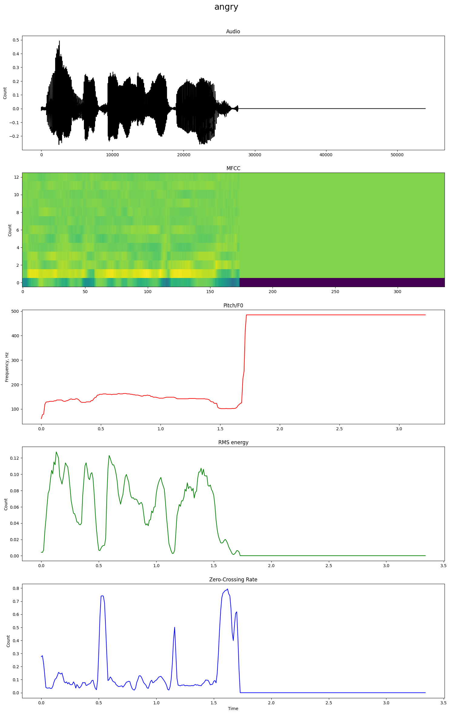
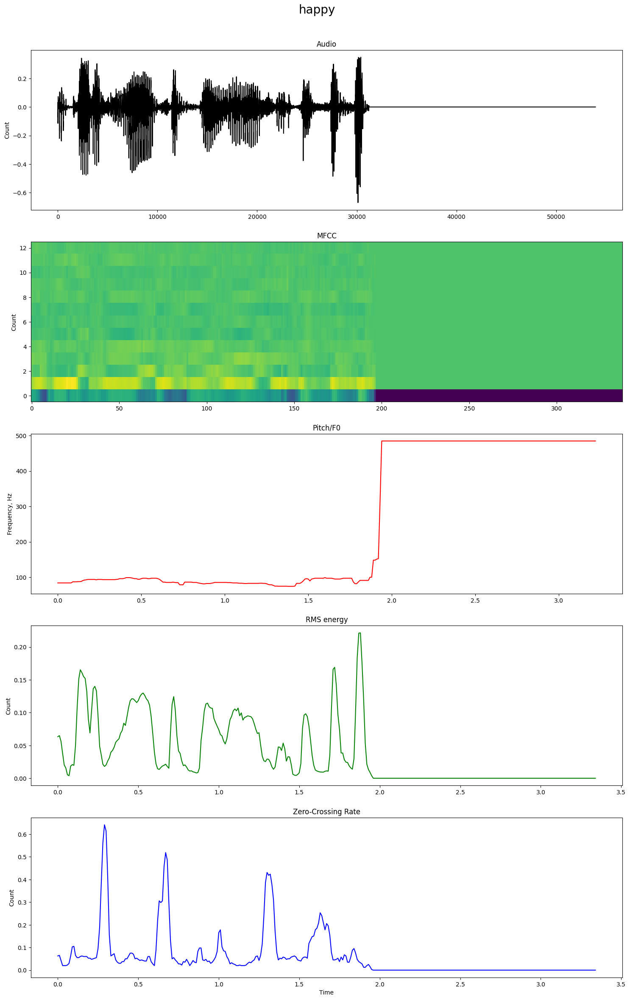
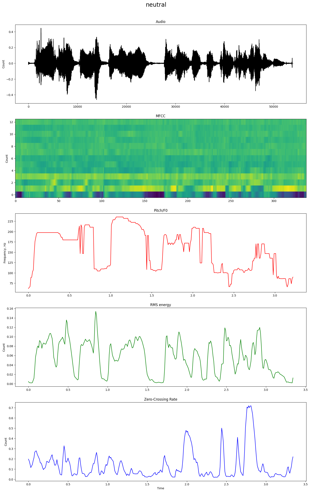
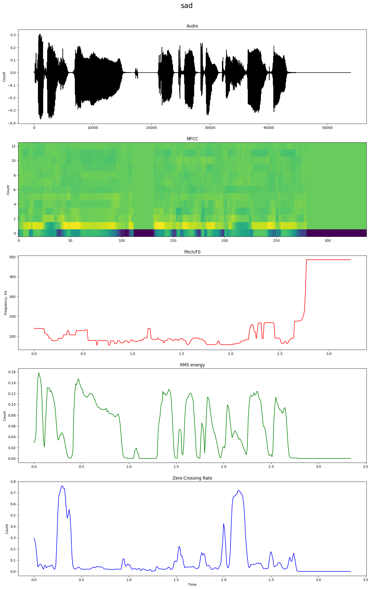

### BaseLines 

| Model (MFCC)          |  Accuracy  |    UAR     | Macro F1-score |
|:----------------------|:----------:|:----------:|:--------------:|
| **AdaBoost**          |   44.75%   |   45.31%   |     44.20%     |
| **Nearest Neighbors** |   40.33%   |   40.02%   |     39.56%     |
| **Random Forest**     | **48.07%** | **48.63%** |   **47.48%**   |

| Model (f0)            |  Accuracy  |    UAR     | Macro F1-score |
|:----------------------|:----------:|:----------:|:--------------:|
| **AdaBoost**          |   35.36%   | **35.60%** |     32.79%     |
| **Nearest Neighbors** | **34.81%** |   34.76%   |   **33.74%**   |
| **Random Forest**     |   33.70%   |   34.13%   |     31.24%     |

| Model (RMS)           |  Accuracy  |    UAR     | Macro F1-score |
|:----------------------|:----------:|:----------:|:--------------:|
| **AdaBoost**          |   37.02%   |   37.51%   |     36.71%     |
| **Nearest Neighbors** |   25.97%   |   25.50%   |     24.69%     |
| **Random Forest**     | **39.23%** | **39.49%** |   **39.38%**   |

| Model (0crossing)     |  Accuracy  |    UAR     | Macro F1-score |
|:----------------------|:----------:|:----------:|:--------------:|
| **AdaBoost**          |   34.81%   |   33.55%   |     29.38%     |
| **Nearest Neighbors** |   29.83%   |   29.26%   |     28.47%     |
| **Random Forest**     | **37.57%** | **37.16%** |   **36.58%**   |

## Self-Supervised Approach

| Model        |  Accuracy  |    UAR     | Macro F1-score |
|:-------------|:----------:|:----------:|:--------------:|
| **wav2vec2** | **75.69%** | **75.75%** |   **75.58%**   |
| **data2vec** |   54.70%   |   55.38%   |     52.66%     |

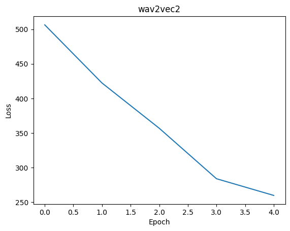
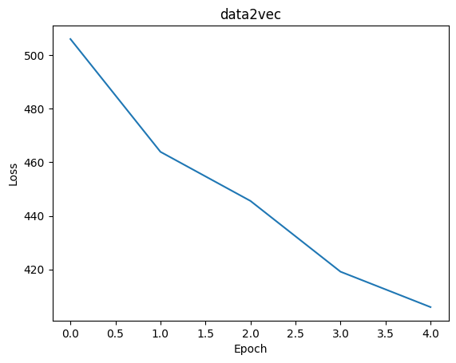

---

Train 5 epoches:

| Model        |  Accuracy  |    UAR     | Macro F1-score |
|:-------------|:----------:|:----------:|:--------------:|
| **wav2vec2** | **27.07%** | **25.00%** |   **10.65%**   |
| **data2vec** |   25.41%   | **25.00%** |     10.23%     |

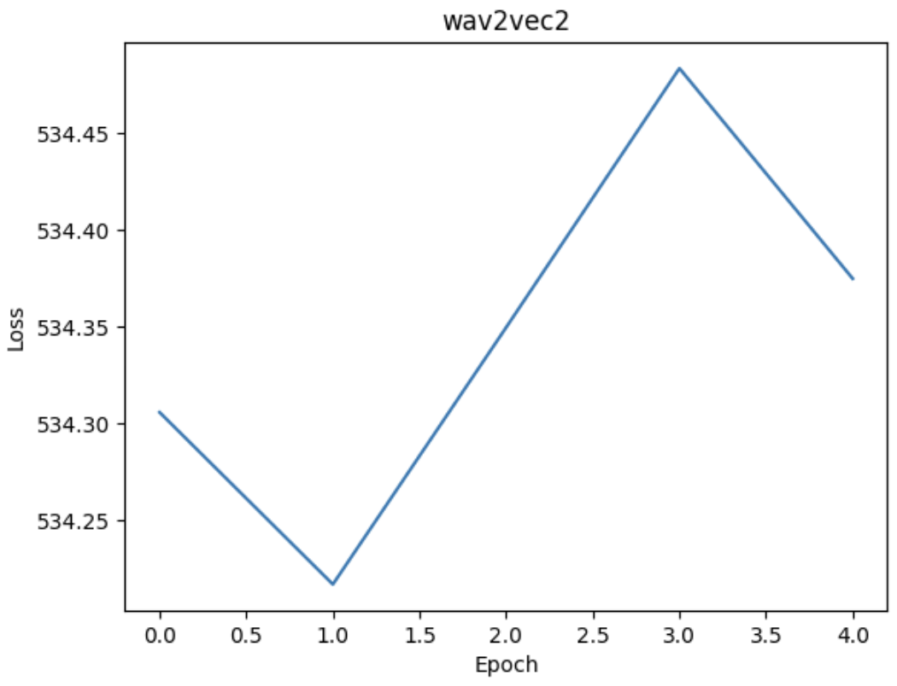
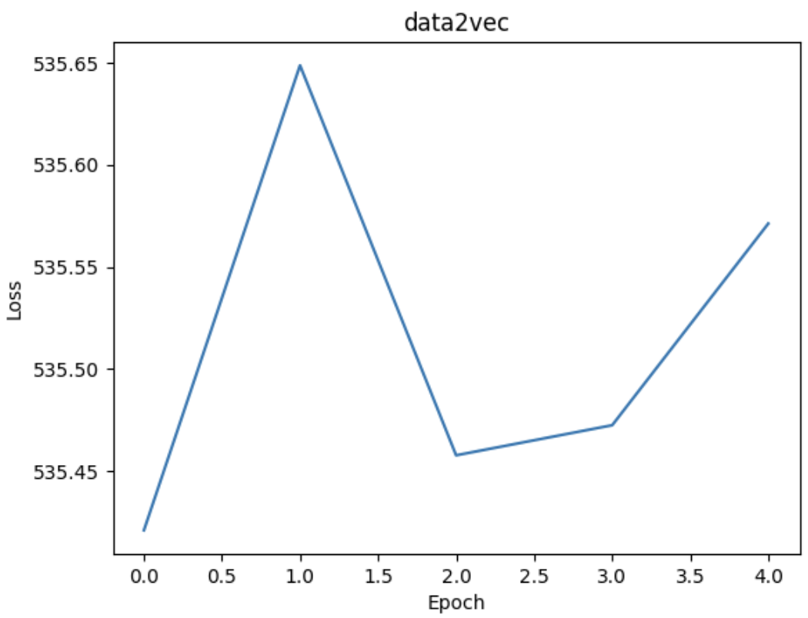

Train +5 epoches (10):

| Model        |  Accuracy  |    UAR     | Macro F1-score |
|:-------------|:----------:|:----------:|:--------------:|
| **wav2vec2** | **27.07%** | **25.00%** |   **10.65%**   |
| **data2vec** |   25.41%   | **25.00%** |     10.22%     |

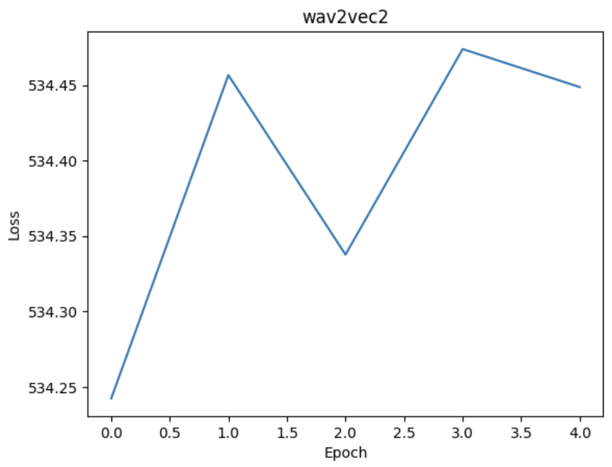
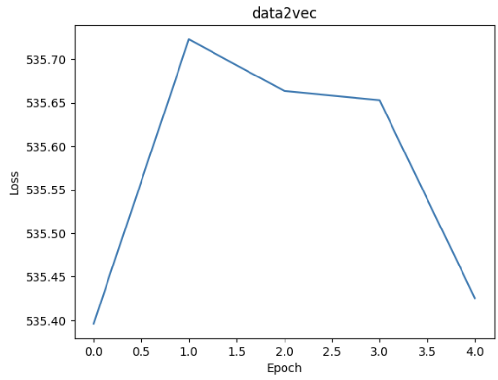

Train 20 epoches:

| Model        |  Accuracy  |    UAR     | Macro F1-score |
|:-------------|:----------:|:----------:|:--------------:|
| **wav2vec2** |   25.41%   |   25.00%   |     10.13%     |
| **data2vec** | **27.62%** | **25.83%** |   **15.68%**   |

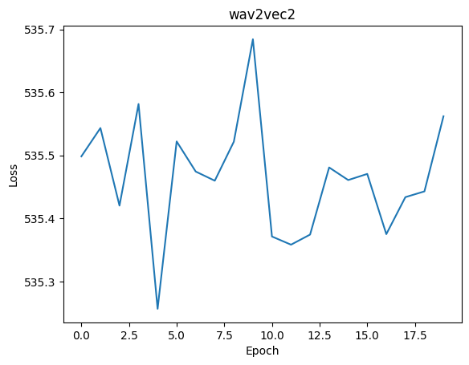
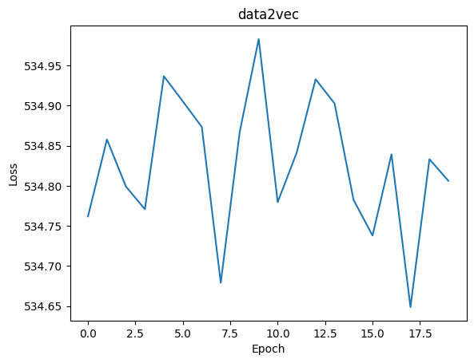

## References

1. https://scikit-learn.org/stable/auto_examples/classification/plot_classifier_comparison.html
