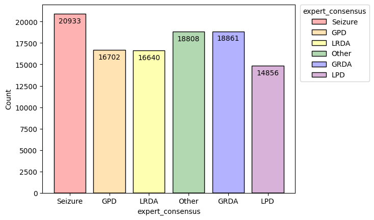
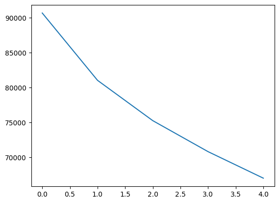
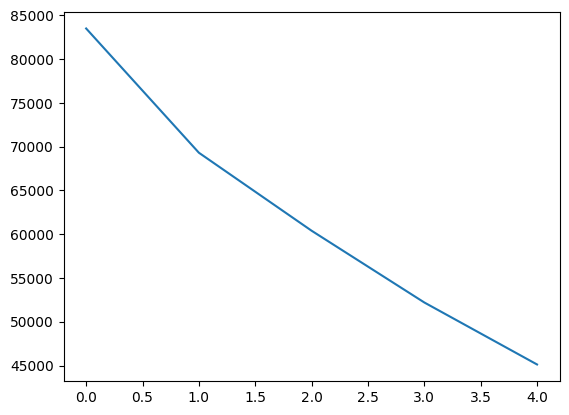
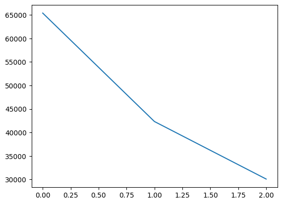

# Solve the Audio Classification

Dataset contains 106800 observations and only 1950 unique patient. 

**CNN** \

**resnet50** \

**resnet18** \

| Model (MFCC)   | Accuracy |  UAR   | Macro F1-score |          Competition          |
|:---------------|:--------:|:------:|:--------------:|:-----------------------------:|
| **Custom CNN** |  39.97%  | 40.65% |     40.15%     |  |
| **resnet50**   |  37.63%  | 37.12% |     37.11%     |                               |
| **resnet18**   |  34.21%  | 33.37% |     32.95%     |                               |
